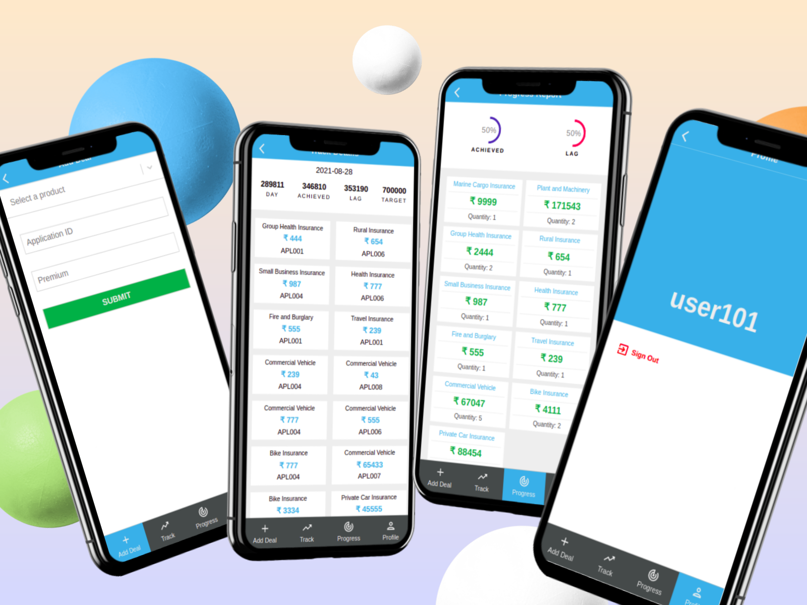

# Deals Tracker


Deals Tracker is a web application to track successful deals by a fictitious insurance company.
It can be used by sales executives to record their deals and track the premium and target.

### Features:
- A new user has to register themselves by creating a unique username that should be 4-8 characters long, a password, and confirm it.
- An existing user can just log in into the app by entering their username and password.
- After successful login users will be directed to the profile page where they can view their username and a button to log out from the application.

The app contains four tabs. They are Add Deal, Track, Progress, and Profile.

#### Add Deal:
In this tab, the user is presented with a simple form to record a new deal. They have to select the product from the dropdown list, enter the premium amount and application id which will be helpful to further track that policy in company CMS, and submit the form to create the record.

#### Track:
- This tab categorizes all the deals associated with the user date-wise with the recent first. The user can get an overview of the total premium collected for a particular day and the associated policies count.
- A user can further click on any item to go to the details page and view the detailed information about that particular day.

This page is divided into two sections:

- At the top user can see some statistics to track their achievement. The user can view the premium collected for that particular day, the total premium collected till now, their target, and lag amount to hit the target.
- The bottom section lists detailed information about each deal. It shows the name of the product, application id, and the premium amount for each deal for the selected date.
- A user can tap or click the back button available in the App bar to go back to the track page.

#### Progress:
- This page provides a quick glimpse of the user progress graphically. This page is also divided into two sections:
- The top section shows the target achieved and lag percentage graphically.
- The bottom section displays the total achievement product-wise.

#### Profile:
On this page the user and see their credentials and perform the logout operation.





## Live Demo

[View Live](https://tracking-app-frontend.herokuapp.com/)

## Built With 🛠

```
- HTML
- CSS
- React
- Redux / Redux Toolkit
- Material UI
```

## Getting Started

> To get a local copy up and running follow these simple example steps.

### Prerequisites

- Good to have a text editor installed on your machine. You can use any default text editor that comes with the system
  like Notepad but advanced text editors like Visual Studio Code, Atom or Sublime is recommended. It will help you to
  interact with the source code.

### Setup

Refer the following documentations to download the Text Editor of your choice:

[VS Code](https://code.visualstudio.com/)

[Atom](https://atom.io/)

[Sublime Text](https://www.sublimetext.com/)

### Usage
- Clone this Repository using following command

<pre><code>git clone https://github.com/KumarAmitt/tracking-app-frontend.git</code></pre>

- Navigate to the directory `tracking-app-frontend` in your File Explorer.

- Run `npm install` to install dependencies.
- Run`git checkout tracking` to switch to the feature branch.
- Run `npm run start` to run the app in browser. Recommended: Chrome/Firefox

- If you wish to play around the codes, navigate to this Repository in the Text Editor of your choice.

## Testing

- Run `npm run test` from terminal to run the tests.

## Author

### 👨‍💻 Amit Kumar

- GitHub: [@KumarAmitt](https://github.com/KumarAmitt)
- Twitter: [@ArrshAmit](https://twitter.com/ArrshAmitt)
- LinkedIn: [@kumar-amitt](https://www.linkedin.com/in/kumar-amitt)

### 🤝 Contributing

Contributions, issues, and feature requests are welcome!

Feel free to check the [issues page](https://github.com/KumarAmitt/tracking-app-frontend/issues).

### Credits

The UI is inspired from a weight measurement app [Bodytrack.it](https://www.behance.net/gallery/13271423/Bodytrackit-An-iOs-app-Branding-UX-and-UI) by Gregoire Vella.

### Show your support

Give a ⭐️ if you like this project!

### License

&copy; 2021 Amit Kumar

Permission is hereby granted, free of charge, to any person obtaining a copy
of this software and associated documentation files (the "Software"), to deal
in the Software without restriction, including without limitation the rights
to use, copy, modify, merge, publish, distribute, sublicense, and/or sell
copies of the Software, and to permit persons to whom the Software is
furnished to do so, subject to the following conditions:

The above copyright notice and this permission notice shall be included in all
copies or substantial portions of the Software.

THE SOFTWARE IS PROVIDED "AS IS", WITHOUT WARRANTY OF ANY KIND, EXPRESS OR
IMPLIED, INCLUDING BUT NOT LIMITED TO THE WARRANTIES OF MERCHANTABILITY,
FITNESS FOR A PARTICULAR PURPOSE AND NON INFRINGEMENT. IN NO EVENT SHALL THE
AUTHORS OR COPYRIGHT HOLDERS BE LIABLE FOR ANY CLAIM, DAMAGES OR OTHER
LIABILITY, WHETHER IN AN ACTION OF CONTRACT, TORT OR OTHERWISE, ARISING FROM,
OUT OF OR IN CONNECTION WITH THE SOFTWARE.

